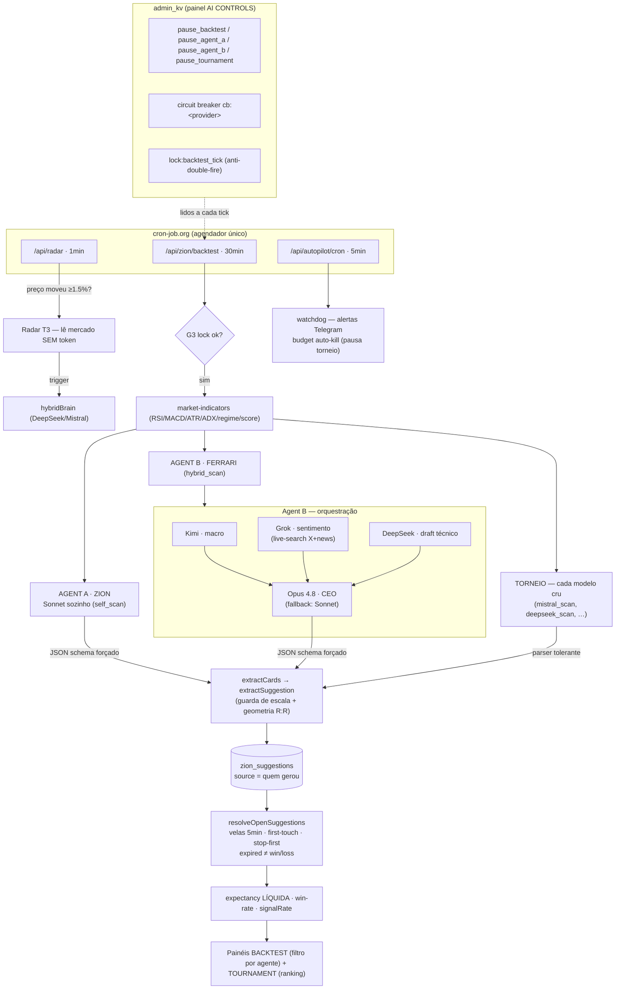

# Z-SWAP — Arquitetura de IA (ZION + Ferrari híbrida)

> Documento técnico completo do uso de IA na plataforma. Escrito pra revisão
> externa: descreve **o quê**, **como** e **por quê**. Estado em 2026-07-01.

---

## 0. Contexto

Z-SWAP é uma **DEX agregadora multi-chain** (Solana como rede principal + ~10
EVM chains) com um assistente de IA de trading chamado **ZION** (advisory +
autopilot CEX). Stack: Next.js (App Router) na Vercel (serverless), Supabase
(Postgres) e Helius (RPC Solana). Este doc cobre **toda** a camada de IA.

---

## 1. Princípios-mãe (o "porquê" por trás de tudo)

1. **Custo baixo no trabalho de alta frequência; qualidade de fronteira só onde
   move dinheiro.** Não pagar modelo caro pra tarefa repetitiva.
2. **Medir tudo — nada é opinião, é número.** A qualidade do ZION é medida por
   *expectancy* (retorno médio por trade), não por "achismo".
3. **Soberania de dado** — rotear o modelo por jurisdição do usuário.
4. **Regra de ouro #1 — LLM PROPÕE, CÓDIGO DISPÕE.** Nenhum LLM é autoridade
   final de risco. O LLM gera tese e níveis; a matemática dura (teto de notional,
   sizing, R:R, distância de liquidação) fica em **código determinístico**
   (`price-guard`). Motivo: LLM erra escala/aritmética (ex real: um modelo emitiu
   "LINK a 7323" em vez de 7.32 — erro de 1000x).
5. **Regra de ouro #2 — VALIDAR EDGE ANTES DE MIGRAR DINHEIRO.** Custo é
   downstream do lucro. Só troca o modelo de um caminho de dinheiro real depois
   que a medição provar que o modelo mais barato mantém o edge.

---

## 2. A base de tudo: o Shadow Flywheel (medição)

Antes de decidir QUAL modelo usar, precisamos MEDIR cada um. O Shadow Flywheel
faz isso:

- A cada ciclo, o ZION emite **previsões direcionais** (comprar/vender X, com
  entry, target, stop, probabilidade) sobre os majors.
- Cada previsão é **registrada** na tabela `zion_suggestions` com o **preço real
  de mercado no momento** (`ref_price`), o `source` (qual agente/modelo gerou), o
  regime, etc.
- Depois, um resolvedor **reproduz as velas reais** (klines de 1h da Binance) do
  momento da previsão até agora e detecta o **primeiro toque**: bateu no target
  primeiro (win) ou no stop primeiro (loss); se ambos na mesma vela, assume stop
  (convenção pessimista/honesta).
- Agrega **expectancy, win-rate, R:R médio, profit-factor** — por `source`.

**Por que isso importa:** transforma "o ZION funciona" numa **métrica auditável**.
E como cada modelo/agente loga com um `source` diferente, comparamos todos **sobre
o MESMO dado de mercado** (amostras pareadas).

Guardas de qualidade no registro (`extractSuggestion`): rejeita geometria quebrada
(target no lado errado, target colado na entrada, R:R < 1) e **preço fora de
escala** (entry desviando >25% do preço real = alucinação do LLM).

Regra de leitura honesta: **≥30 resolvidos por source** antes de concluir; a
métrica é **expectancy**, não win-rate (50% de acerto com R:R < 1 ainda perde).

---

## 3. Os agentes — e por que cada um existe

Todos rodam no MESMO tick do flywheel, sobre o MESMO dado, logando `source`
distinto. São experimentos paralelos:

### Agente A — ZION Sonnet (baseline) · `source: self_scan`
- **O quê:** o ZION atual, **um único modelo** (Claude Sonnet 4.6) fazendo a
  análise sozinho. Nunca aciona outro modelo.
- **Por que existe:** é a **linha de base**. Toda comparação é "melhora sobre o A".

### Agente B — Ferrari híbrida (orquestração de especialistas) · `source: hybrid_scan`
- **O quê:** cada modelo na sua **área mais forte**, fundidos por um CEO:
  - **Kimi** → digestão MACRO (contexto gigante: dominância, liquidez, DXY/S&P).
  - **Grok** → SENTIMENTO (nativo do X/social).
  - **DeepSeek** → CÉREBRO técnico/quant (tese direcional dos indicadores).
  - **Opus 4.8** → **CEO**: sintetiza os 3 relatórios + a tese técnica na decisão final.
  - Os 3 especialistas rodam em **paralelo**; o Opus funde tudo.
- **Por que existe:** testar se a **orquestração híbrida** (barato no braçal +
  fronteira na decisão) entrega expectancy **melhor** que o Sonnet sozinho, a
  uma fração do custo.
- **Por que "híbrido de verdade":** se usássemos um modelo só, não seria híbrido.
  O valor está em somar as forças (macro + sentimento + técnica) numa síntese.

### Torneio individual · `source: deepseek_scan / mistral_scan / kimi_scan / grok_scan`
- **O quê:** cada modelo barato rodando **sozinho** (sem orquestração).
- **Por que existe:** descobrir **qual modelo barato é o melhor cérebro**. O
  vencedor vira o cérebro do Agente B (`HYBRID_BRAIN=<id>`) e a escolha do
  geo-routing. Roda em paralelo à Ferrari (não é redundante — mede o modelo cru
  vs o modelo orquestrado).

### Radar (T3) · `source: radar`
- **O quê:** sugestões geradas **por gatilho de preço** (evento), não por timer.
- **Por que existe:** testar a hipótese do T3 — **entradas disparadas por
  movimento de preço têm expectancy melhor que as por timer cego?**

---

## 4. Como ler o mercado SEM gastar token (o T3 / radar de preço)

Arquitetura de **3 camadas por valor em jogo**:

| Camada | Papel | Frequência | Custo |
|--------|-------|-----------|-------|
| **T3 — Radar de preço** | Vigia preço, dispara no gatilho | contínuo (~1 min) | **SEM IA** (código) |
| **T2 — Braçal/macro/sentimento** | Scan, docs, humor | alta | modelos baratos |
| **T1 — Decisão final** | Tese + risco + ordem | rara (trade real) | fronteira (Opus/GPT) |

**O radar (T3), em detalhe** (`/api/radar`, roda a cada ~1 min via cron):
1. Faz **uma** chamada barata pegando o preço dos majors + lê uma **referência**
   por símbolo no banco (`admin_kv`). **Zero token de IA.**
2. Se o preço moveu **≥ 1.5%** desde a referência → **gatilho** (e reseta a
   referência). Senão, não faz nada.
3. **Só no gatilho** ele "acorda" o modelo barato — **só nos símbolos que
   dispararam** — pra analisar se é hora de entrar. Loga a sugestão como `radar`.

Ou seja: **código determinístico vigia 24/7 de graça; a IA só acende quando o
preço realmente mexe.** Isso é o que impede a conta de token de explodir.

---

## 5. A camada de provider (seam) + geo-routing

### O seam (`src/lib/ai/provider.ts`)
Uma **interface única** sobre dois backends, retornando o MESMO formato
(texto + uso de tokens normalizado):
- `anthropicChat` — SDK nativo da Anthropic (com prompt caching).
- `openaiCompatChat` — qualquer endpoint OpenAI-compatible (DeepSeek, Kimi,
  Mistral, Grok, Llama). Um `fetch` pra `/chat/completions`.

**Por quê:** trocar/adicionar modelo sem o resto do código saber qual vendor
respondeu. Rastreamento de custo e o A/B tratam todo modelo igual.

### O registry + geo-routing (`src/lib/ai/registry.ts`)
- **Direto da fonte, SEM OpenRouter** (sem taxa de intermediário, controle total).
- Detecta o **país do acesso** (`x-vercel-ip-country`, nativo do Vercel) e escolhe
  o stack sozinho:
  - `china_ok` (Brasil, LatAm, sem sanção) → **DeepSeek / Kimi** (mais baratos).
  - `western` (EUA + aliados: Five Eyes, UE/EEA, JP/KR/TW) → **Mistral / Llama /
    Grok** (origem ocidental).
  - País desconhecido → **western** (fail-safe: nunca manda dado pra modelo de
    origem chinesa sem confiança na jurisdição).
- **Por quê:** IA chinesa (DeepSeek/Kimi) tem risco regulatório em EUA/aliados. O
  risco é sobre **onde o dado vai**; roteando por jurisdição, cada mercado usa um
  stack conforme. Vira **argumento de venda enterprise** ("residência de dado por
  jurisdição do cliente").
- **Papéis** (`roleProvider`): brain / macro / sentiment resolvem o modelo por
  função (com override `HYBRID_<ROLE>`).

---

## 6. Os modelos e seus papéis (preços jun/2026, por 1M tokens)

| Modelo | Origem | Papel na Ferrari | Input | Output |
|--------|--------|------------------|-------|--------|
| Claude Sonnet 4.6 | 🇺🇸 Anthropic | Agente A (baseline) | $3 | $15 |
| Claude Opus 4.8 | 🇺🇸 Anthropic | **CEO** (síntese) | ~$5 | ~$25 |
| DeepSeek V4 | 🇨🇳 | cérebro técnico | $0.435 | $0.87 |
| Kimi K2.6 | 🇨🇳 | macro (256K ctx) | $0.80 | $3.40 |
| Mistral | 🇫🇷 | cérebro ocidental | ~$2 | ~$6 |
| Grok 4.3 | 🇺🇸 xAI | sentimento (X nativo) | $1.25 | $2.50 |
| Llama 4 | 🇺🇸 Meta | ocidental (lista de espera) | ~$0.2 | ~$0.6 |

Claude (Sonnet e Opus) **compartilham uma única API key** — o modelo é escolhido
por request, não por key. Os demais são cada um sua key, direto do vendor.

---

## 7. Infra de cron (como roda sozinho, 24/7)

Três endpoints server-side, todos autenticados por `CRON_SECRET` (Bearer):
- `/api/autopilot/cron` — a cada ~5 min (execução + watchdog de alertas).
- `/api/zion/backtest` — a cada ~30 min (o flywheel: gera + resolve sugestões).
- `/api/radar` — a cada ~1 min (o T3 radar de preço).

**Quem dispara:** **cron-job.org** (serviço externo confiável). Antes usávamos
GitHub Actions, mas o agendador dele é best-effort e atrasava/pulava
(15min–horas), deixando os crons parados sem avisar. cron-job.org dispara certo
e ainda alerta por email na falha.

**Padrão serverless (`waitUntil`):** o scan pesado (indicadores + LLM + resolve)
leva 30-45s, mas cron pingers cortam em 30s. Então o endpoint **responde na hora**
e termina o trabalho em background via `waitUntil` (a função vive até
`maxDuration` de 60s). Resultado verificado no banco, não na resposta.

**Por que não segurar um WebSocket 24/7:** funções serverless da Vercel são
efêmeras (morrem em segundos), não seguram conexão persistente. Por isso o radar
é **poll a cada 1 min** (Opção "cron-radar") em vez de WebSocket sempre-ligado.
Pra swing em cripto, 1 min de grão é suficiente.

---

## 8. Rastreamento de custo (`src/lib/admin/ai-cost.ts`)

Estimador **ciente de modelo**: cada evento de análise grava o modelo + tokens
(input/output/cache-read/cache-write); o custo é calculado com a tarifa do
modelo certo (Opus/Sonnet/Haiku exatos; Kimi/DeepSeek/Mistral/Grok/Llama
aproximados). O painel admin (FINANCE) mostra **custo por modelo** e por janela
(hoje/semana/mês/ano). Isso permite comparar **$/análise** entre modelos e
recalibrar o preço dos planos sem prejuízo.

---

## 9. Resolução das sugestões (como vira expectancy)

`resolveOpenSuggestions`: pega as sugestões abertas, e pra cada uma **reproduz as
velas de 1h** da criação até `min(agora, horizonte)`:
- Detecta o **primeiro** nível tocado (target/stop) no tempo — não a "foto final".
- Ambos na mesma vela → assume stop (pessimista).
- Sem toque no horizonte → resultado direcional pela close.
- Fallback: se não houver velas, checa o preço spot atual.

Custa **zero token** (é só preço). Roda em todo tick do backtest, mesmo quando o
crédito de IA está zerado — então a medição continua colhendo resultado dos
trades abertos mesmo sem gerar novos.

---

## 10. Estado atual (honesto)

- **Agente A (Sonnet)** e o **CEO Opus do Agente B**: dormentes até 11/07 (crédito
  Anthropic zerado). Agente B tem um master switch `HYBRID_B_ENABLED` (off) pra
  não gastar nos especialistas sem o CEO poder fechar a síntese.
- **Torneio individual (DeepSeek/Mistral/Kimi/Grok)** e o **radar**: rodam **agora**
  (keys deles ativas).
- **Geo-routing:** construído; o **flip do caminho do usuário** pros modelos
  baratos só liga depois do A/B validar (usuário fica no Sonnet até lá).
- **Sentimento do Grok:** hoje é um "read" geral; o pipeline real de ingestão do X
  (baleias/notícias) é uma feature separada ainda não construída.
- **Autopilot de dinheiro real:** intocado, fica no Claude — nada disso mexe em
  execução real até validação + pós-11/07.

---

## 11. Arquivos de código principais

- `src/lib/ai/provider.ts` — seam (anthropicChat / openaiCompatChat).
- `src/lib/ai/registry.ts` — modelos, papéis, geo-routing.
- `src/lib/zion/backtest.ts` — flywheel: `runBacktestScan` (A), `runHybridScan`
  (B), `runBacktestScanForProvider` (torneio), `resolveOpenSuggestions`,
  `getBacktestStats`, guardas de qualidade.
- `src/lib/zion/radar.ts` + `src/app/api/radar/route.ts` — T3 radar.
- `src/app/api/zion/backtest/route.ts` — o tick do flywheel (roda todos em paralelo).
- `src/lib/admin/ai-cost.ts` — custo por modelo.
- `src/lib/admin/health.ts` / `watchdog.ts` — radar de saúde + alertas Telegram.
- `src/lib/autopilot/price-guard.ts` — a matemática de risco determinística (Regra #1).

---

## 12. Onde queremos opinião (perguntas pra revisão externa)

1. A arquitetura de 3 camadas (radar sem-IA → braçal barato → decisão fronteira)
   é o jeito certo de balancear custo × qualidade?
2. A Ferrari (Kimi macro + Grok sentimento + DeepSeek cérebro + Opus CEO) é uma
   orquestração sensata? Falta algum especialista/papel?
3. O método de medição (Shadow Flywheel + expectancy + amostras pareadas) é
   rigoroso o suficiente pra decidir qual agente vence?
4. O geo-routing por jurisdição resolve bem o risco de soberania de dado?
5. Riscos que não estamos vendo (viés no backtest, overfitting, custo escondido,
   latência, confiabilidade dos provedores)?
6. Faz sentido rodar A + B + torneio + radar em paralelo, ou é desperdício?

---

## ANEXO A — Como a análise é feita (dados, matemática e código)

O LLM **não olha gráfico**. O código calcula um retrato técnico numérico e
injeta como TEXTO no prompt. Arquivo: `src/lib/api/market-indicators.ts`.

### A.1 Coleta de dados (fontes + timeframes)
- **Klines (candles)** da Binance (mirror `data-api.binance.vision`, sem
  geo-bloqueio): **1h, 4h, 1D, 1W**. Revalidação cacheada (1h=60s, 4h/1D=300s).
- **Order book** (depth 20 níveis) — spread, imbalance, slippage.
- **Funding + Open Interest** (Binance FAPI, perpétuos).
- **Fear & Greed Index** (alternative.me).
- **Macro** (`macro.ts`): dominância BTC/ETH + mcap (CoinGecko), supply de
  stablecoins (DefiLlama), DXY + S&P (Yahoo).
- Tokens DEX (fora dos majors CEX): OHLCV via GeckoTerminal (mesma matemática).

### A.2 Indicadores e a MATEMÁTICA (todos calculados em código puro)
- **EMA(p):** semente = SMA dos primeiros p; depois `EMA = close·k + EMAprev·(1−k)`, `k = 2/(p+1)`. Usa EMA20 e EMA50.
- **RSI(14) — Wilder:** média de ganhos e perdas suavizada; `RS = avgGain/avgLoss`; `RSI = 100 − 100/(1+RS)`. Calcula o **array inteiro** (pra ver trajetória, não só o valor atual).
- **MACD(12,26,9):** `MACD = EMA12 − EMA26`; `Signal = EMA9(MACD)`; `Histograma = MACD − Signal`. Guarda o **histograma anterior** (`histPrev`) pra saber a DIREÇÃO do momentum (crescendo/encolhendo).
- **ATR(14) — Wilder:** True Range = `max(high−low, |high−closePrev|, |low−closePrev|)`, suavizado. Usado pra dimensionar stops à **volatilidade real** (não % fixo).
- **ADX(14) + DI:** força de tendência via Directional Movement. Define o **regime** (abaixo).
- **OBV** (On-Balance Volume) + tendência (rising/falling/flat).
- **Volume relativo** (vs média de 20).
- **Divergência de RSI** (preço faz novo topo/fundo, RSI não → reversão).
- **Suporte/Resistência** (5 níveis por pivôs locais) + **Pivôs diários** (clássicos PP/R1/S1…).

### A.3 Regime (o que mais importa — muda como ler o RSI)
```
ADX ≥ 25 → TENDÊNCIA (TRENDING_UP se +DI ≥ −DI, senão TRENDING_DOWN)
ADX < 20 → RANGING (lateral)
senão    → TRANSITIONING
```
**Por quê:** RSI extremo em tendência ≠ reversão (não fade); em range, RSI
extremo reverte. O regime **inverte a leitura dos osciladores**.

### A.4 Multi-timeframe + alinhamento
1h dá o sinal; 4h/1D/1W dão o **filtro de tendência**. O código computa a
direção (bull/bear/neutro) em cada TF e o **alinhamento**:
`aligned_bull` (2+ bull, 0 bear), `aligned_bear`, `conflict`, `mixed`. Impede o
ZION de operar contra a maré primária.

### A.5 Contexto de ciclo (olhar meses/anos — Z1/Z2)
- **Posição no range de 1 ano:** `rangePct = (preço − mín1a)/(máx1a − mín1a)·100`
  + distância da máxima do ciclo. (Perto do fundo = melhor R/R pra long.)
- **Trajetória do RSI:** últimos 4 valores (ex "38→45→52→61") — o modelo vê a
  DIREÇÃO do momentum, não o valor congelado.

### A.6 Order book (qualidade de execução)
Spread, imbalance top-5 (advisory — envelhece no round-trip do LLM), e um
**slippage estimado** varrendo $1k pela escada de asks (custo real de um market buy).

### A.7 Confidence Score (0-100) — o compósito ponderado
9 sub-scores (0..1) × pesos (`SCORE_WEIGHTS`, soma 100). Pra SHORT, inverte (100−score):
```
alignment 22 · regime 18 · macd 16 · rsi 12 · cycle 12 · weekly 8 · orderBook 6 · divergence 4 · fearGreed 2
```
Exemplos de sub-score: RSI 50-65 = 1.0 (sweet spot), ≥80 = 0.2 (extremo);
regime TRENDING_UP = 1.0, TRENDING_DOWN = 0.0; cycle rangePct ≤20% = 1.0.
> ⚠️ **Pesos são provisórios, definidos à mão.** O Z7 vai SUBSTITUÍ-los por
> pesos ajustados do ledger (qual dimensão realmente prevê vencedor) — precisa
> das semanas de dado do flywheel. Hoje é sinal direcional, não calibrado.

### A.8 Montagem do prompt → saída do modelo
`formatIndicatorsForPrompt` gera **uma linha de texto por símbolo** com tudo
(ex: `BTC/USDT: price=… | RSI=61 | MACD … | EMA20/50 … | ATR … | ADX=28 | OBV … | regime=TRENDING_UP | trend1h=bullish | score=72`). Isso + o macro + o
**system prompt cacheado** (`ZION_FOUNDATION`, ~10K tokens, com prompt caching)
vão pro modelo. O modelo devolve **ACTION CARDS** em blocos `[[ACTION]]{json}[[/ACTION]]` (kind, entry, target, stop, probabilidade), parseados por `parseZionStream`.

### A.9 Matemática de risco PÓS-análise (Regra de ouro #1 — código, não LLM)
- **Cost-basis / P&L** (`costBasis.ts`): **custo médio ponderado** por ativo.
  Cada venda realiza `(preço_venda − custo_médio) × quantidade`. Alimenta o
  loss-stop diário. STABLES tratadas como caixa.
- **Price-guard** (`price-guard.ts`): antes de QUALQUER ordem, recomputa o
  notional real = `baseAmount × preço_de_referência_fresco` e **rejeita** se
  passar do cap×1.5, do teto absoluto, ou se não conseguir precificar
  (fail-safe). Fecha o buraco do "5 ETH tratado como $5" e o erro de escala do LLM.
- **Real-notional no autopilot:** mesmo se o LLM alucinar o preço, o gasto real
  = quantidade × preço real — e o guard corta antes de mandar pra exchange.

**Resumo:** o LLM recebe um retrato numérico rico e devolve uma tese + níveis; o
CÓDIGO calcula os indicadores, o score, e faz TODA a matemática de risco/execução.

---

## Anexo B — Diagrama da arquitetura (R3.2)


